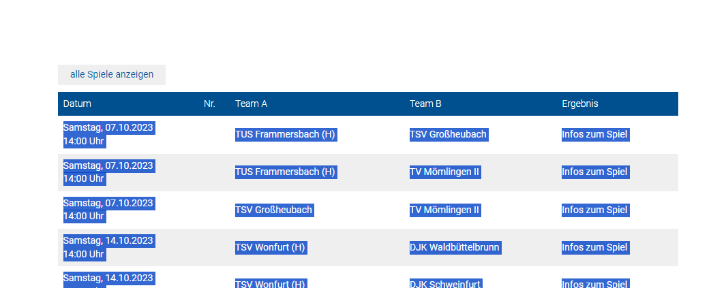
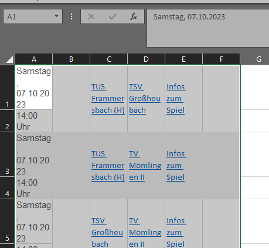
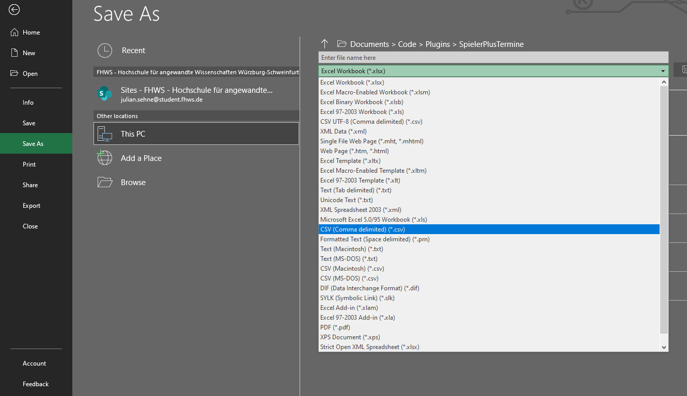
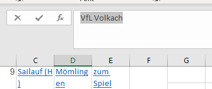
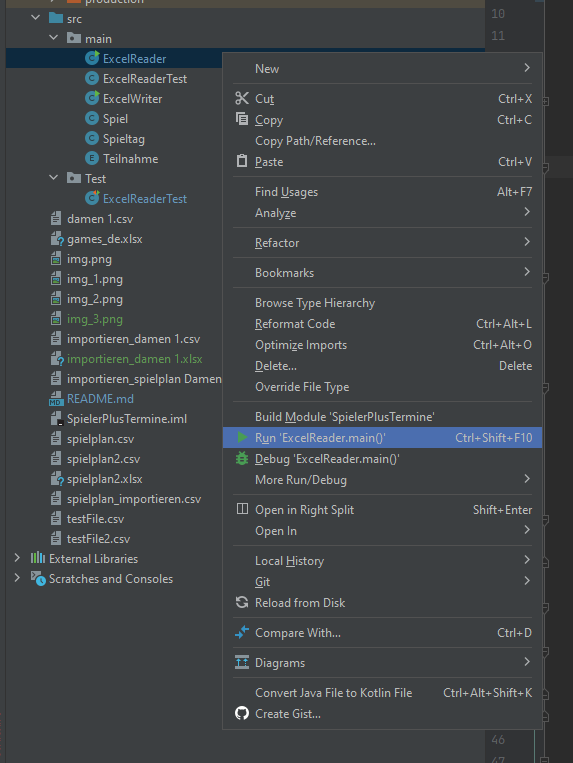
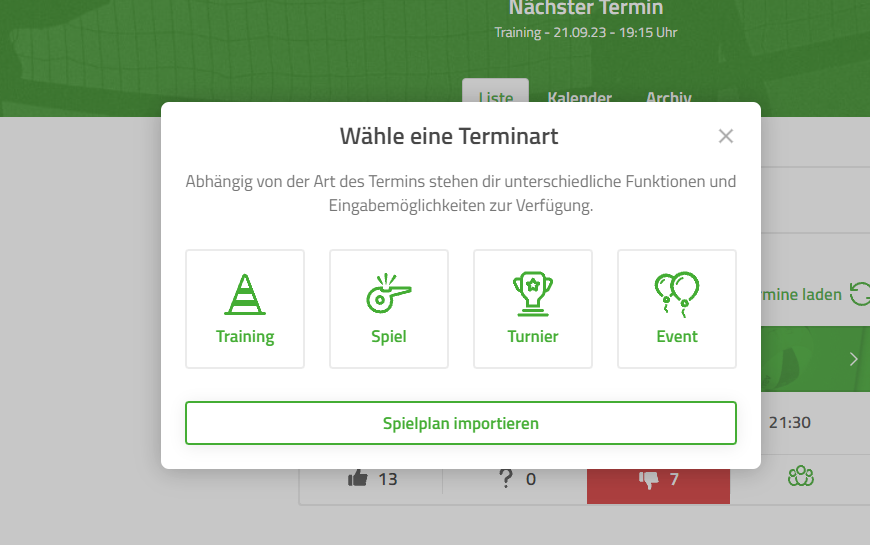
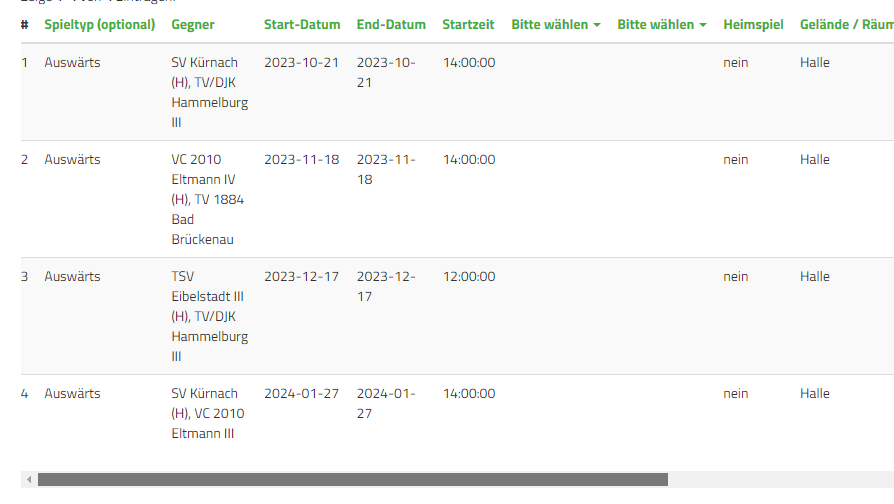
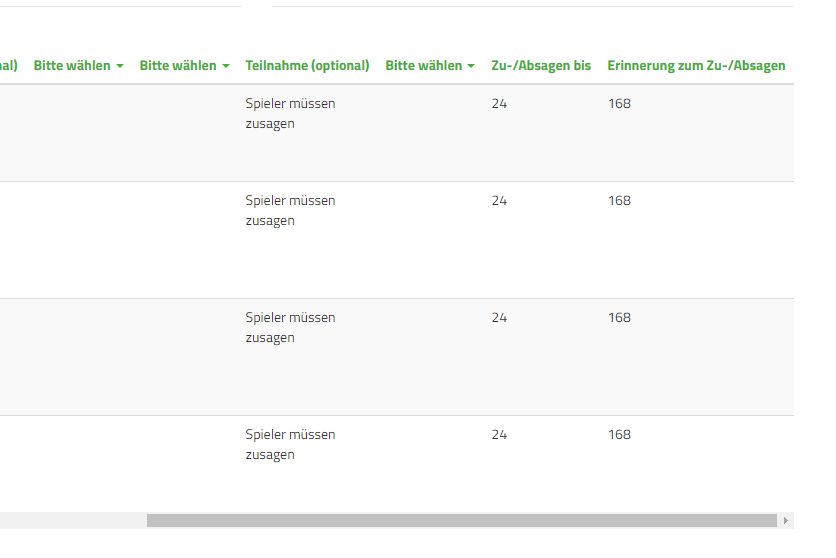

Copy paste All games Table from here
https://volleyball.bayern/ergebnisse/erwachsene/unterfranken?tx_bvv_ausgabe%5Baction%5D=zeigeliga&tx_bvv_ausgabe%5BbezirkMannschaftZuordnung%5D=1000&tx_bvv_ausgabe%5BbezirkZuordnung%5D=60&tx_bvv_ausgabe%5Bwettbewerbid%5D=28721&cHash=41f2f3b9c02ceca9cf2cd9f35c77d784#bvvligaallespiele

without the headers like so 

paste it into blanc excel sheet 

make sure the cells are alligned correctly (time should be in a separate line)

saves as regular CSV 

open the proejct with IntelliJ go to src/main/ExcelReader

move the CSV into the Main Folder of the project make sure the file path in "ExcelReader" is set correctly to the CSV
name that you choose.

enter your values for make sure your team name matches the one in the excel file (copy paste cell value that doesn't
contain "(H)")

set reminder time and due time (value in hours)

run ExcelReader main function

open the created file (which has a similar name to the file that you created) with excel

Let the first line empty (because S+ will ignore the first line when importing)

save as xls

go to S+ website (on PC)
go to events create Event click on import

Upload xls file

match the columns

