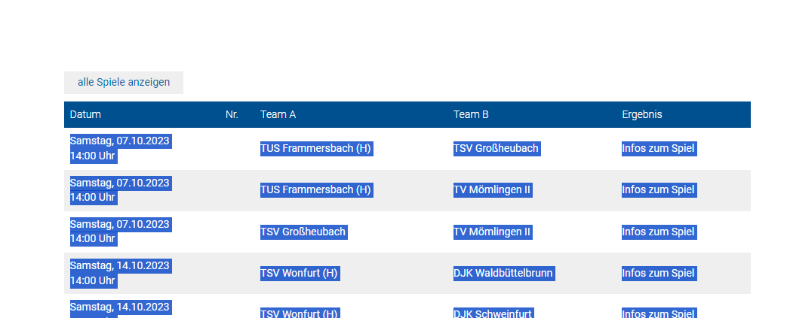
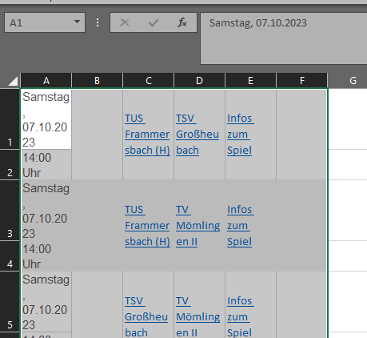
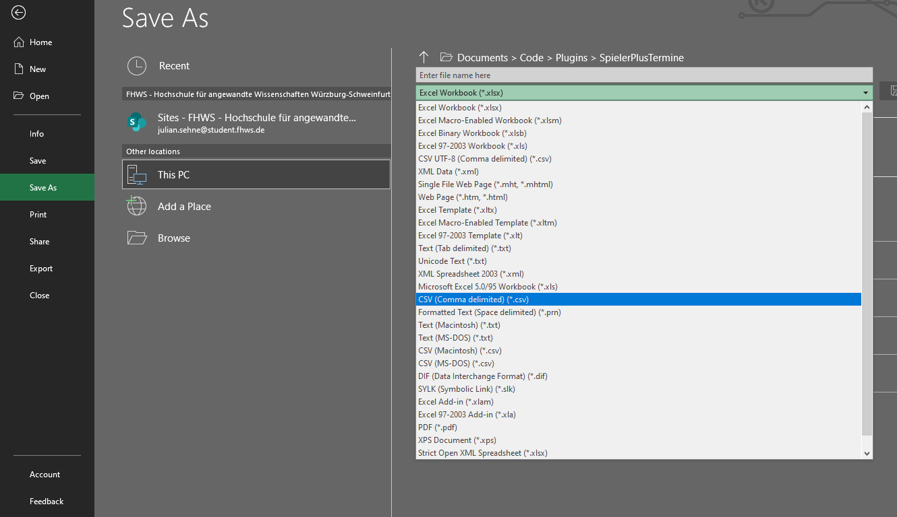
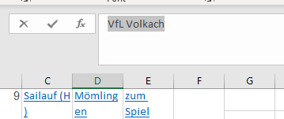
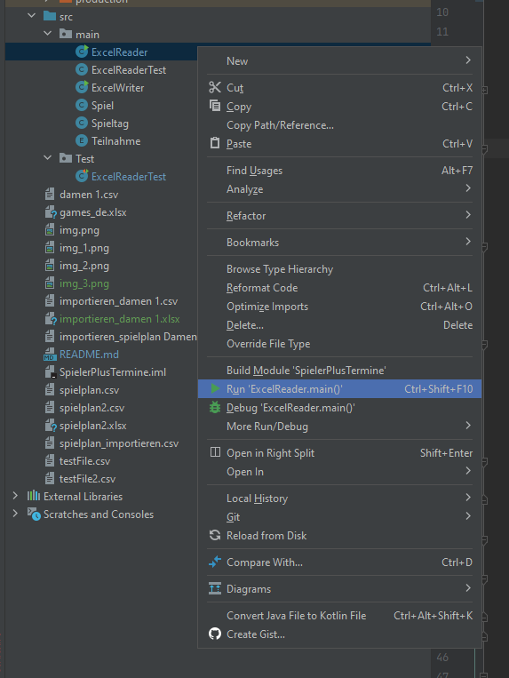
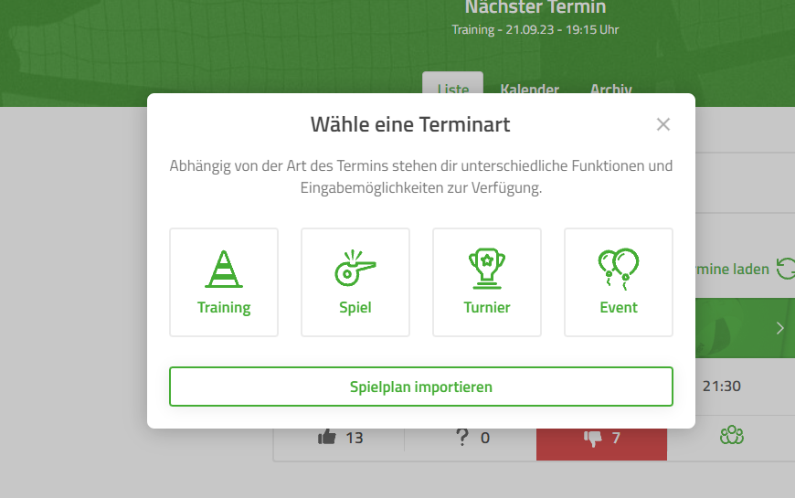
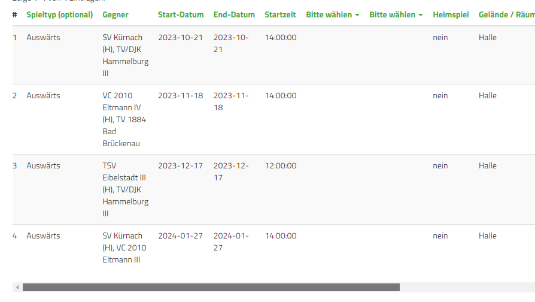
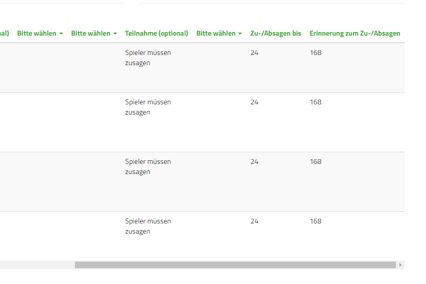

Create S+ Events for games following these instructions

Copy the All games Table from volleyball.bayern (for example here) without the headers
https://volleyball.bayern/ergebnisse/erwachsene/unterfranken?tx_bvv_ausgabe%5Baction%5D=zeigeliga&tx_bvv_ausgabe%5BbezirkMannschaftZuordnung%5D=1000&tx_bvv_ausgabe%5BbezirkZuordnung%5D=60&tx_bvv_ausgabe%5Bwettbewerbid%5D=33817&cHash=88a0748db7d24ce801049e270e1ceb82#bvvligaallespiele

like so 

paste it into blanc excel sheet 

make sure the cells are alligned correctly (time should be in a separate row)

saves as regular CSV 

open the project with IntelliJ go to src/main/ExcelReader

move the CSV into the Projekt Folder (it should be on the same level as this README), make sure the file path in "
ExcelReader" is set correctly to the CSV name that you choose.

enter your values for make sure your team name matches the one in the excel file (copy paste cell value that doesn't
contain "(H)")

set reminder time and due time (value in hours)

run ExcelReader main function

open the created file (which has a similar name to the file that you created) with excel

Leave the first line empty (because S+ will ignore the first line when importing)

save as xls

go to S+ website (on PC)
go to events create Event click on import

Upload xls file

match the columns

